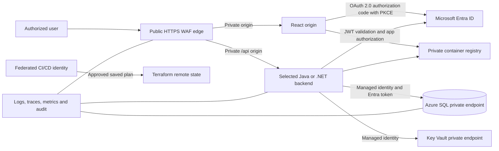

# Enterprise Azure topology reference

This is the lab default, not an approval substitute. Record environment-specific
decisions and any equivalent service substitutions in an ADR before generating
Terraform.



## Trust boundaries

| Boundary | Required control |
|---|---|
| Internet to application | HTTPS only, current TLS policy, WAF prevention mode, managed rules, rate/size controls, health probes, access logs, and no direct origin access |
| User to React/API | Entra authorization-code flow with PKCE, validated issuer/audience/signature/expiry, backend-owned authorization, least-privilege scopes or app roles, and no browser-held client secret |
| Workload to Azure | User-assigned managed identity and resource-specific data-plane roles; no account keys or client secrets |
| Backend to Azure SQL | Entra token authentication, encrypted connection, contained database roles, parameterized access, separate audited migration authority, and no SQL login/password |
| Service network | Private endpoints or approved private origins, private DNS zone links, explicit routes/NSGs/egress, denied public data planes, and tested DNS from workload and operator paths |
| CI/CD to Azure | OIDC workload identity federation with protected environments, scoped role assignments, reviewed plan artifact, digest-bound approval, and private runner connectivity where required |
| Terraform state | Separate bootstrap and ownership, Azure Storage backend, locking, encryption, versioning, soft delete, private access, narrow RBAC, audit, and recovery test |
| Operations | Central diagnostics, trace correlation, protected-data redaction, retention, actionable alerts, Defender/policy controls, budgets, support ownership, and break-glass audit |

## Terraform ownership layout

Generate infrastructure only after the application target exists:

```text
target/<approved-react-backend-azure-sql-root>/infrastructure/
  bootstrap/                 Remote-state and federation bootstrap, separately applied
  modules/
    network/                 VNet, subnets, routes, NSGs, private DNS and endpoints
    identity/                Managed identities and least-privilege assignments
    data/                    Azure SQL, auditing, backup and private connectivity
    application/             WAF edge, private origins, registry and Key Vault references
    observability/           Diagnostics, logs, traces, alerts and budgets
  environments/
    nonproduction/           Backend config and nonsensitive environment inputs
    production/              Separately approved production inputs
  tests/                     Terraform tests and policy/security assertions
  README.md                  Bootstrap, plan, apply, migration, rollback and recovery
```

Keep stateful and shared platform resources in ownership boundaries that can be planned,
approved, recovered, and destroyed independently. Do not create one broad module merely
to shorten files.

## Required review evidence

- Terraform and provider constraints plus the dependency lock file.
- Remote-state identity, network path, retention, recovery, and break-glass owners.
- Every public IP, public network flag, private endpoint, DNS link, route, NSG rule,
  outbound destination, role assignment, policy exception, and diagnostic destination.
- Entra app registration owners, redirect URIs, scopes/app roles, group claims, token
  audiences, managed identities, federated subjects, and database role bootstrap.
- Resource deletes/replacements, state moves/imports, migration order, data backup,
  rollback trigger, cost estimate, capacity, availability zones, RTO, and RPO.
- Protected saved-plan location, SHA-256 digest, expiry, approver, apply identity, state
  serial, and post-apply drift result.

Do not infer private connectivity from a disabled public flag. DNS, routes, network
policy, identity, and an executable connection from each required path must all agree.