# Mainframe modernization accelerator

This repository demonstrates an evidence-first modernization of COBOL and related z/OS application artifacts into React, Azure SQL Database, and either Java with Spring Boot or .NET with ASP.NET Core.

It does not perform file-by-file source translation. It recovers observable business behavior, plans a useful vertical slice, implements that slice across the selected stack, and independently validates the result against approved legacy evidence.

Use the [guided labs](labs/README.md) to learn the modernization process and GitHub Copilot primitives. See [HOW-TO-MODERNIZE.md](HOW-TO-MODERNIZE.md) for the concise operating guide.

## Modernization lifecycle

```mermaid
flowchart LR
    L["Immutable legacy evidence"] --> D["Discovery and documentation"]
    D --> P["MVP and roadmap planning"]
    P --> I["Slice implementation"]
    I --> V["Independent validation"]
    V -->|findings| I
    V -->|passed gates| A["Approved Terraform deployment"]
    A --> X["Independent Azure validation"]
    X -->|findings| A
    X -->|passed gates| N["Next slice or cutover decision"]
```



The lifecycle uses separate GitHub Copilot agents so source interpretation, planning, implementation, and criticism do not collapse into one context:

| Agent | Responsibility | May modify target code |
|---|---|---:|
| Modernization Orchestrator | Select the current lifecycle stage and delegate work | No |
| Legacy Analyst | Recover and document evidenced legacy behavior | No |
| Modernization Planner | Define the MVP, roadmap, contracts, gates, and rollback | No |
| Java Implementation Agent | Build one approved `java-spring` slice | Java target only |
| Dotnet Implementation Agent | Build one approved `dotnet-aspnet-core` slice | .NET target only |
| Validation Critic | Independently test and review the implemented slice | No |
| Azure Deployment Agent | Plan and apply an approval-bound Terraform deployment | Infrastructure only |

## Repository layout

```text
.github/
  agents/                         Role boundaries, tools, and handoffs
  hooks/                          Deterministic legacy-source protection
  instructions/                   Repository and path-specific policy
  scripts/                        Lifecycle gate validation and focused tests
  skills/                         Focused discovery, planning, implementation, validation, and deployment procedures
  templates/modernization/        Canonical lifecycle and artifact indexes
legacy-source/                    Immutable COBOL, copybook, BMS, JCL, DDL, and operational evidence
labs/                             Progressive GitHub Copilot and modernization exercises
modernization/                    Empty generated-evidence workspace; see its README
target/                           Selected Java or .NET application code, tests, infrastructure, and runbooks
```

`legacy-source/` is immutable forensic evidence. Put annotations, normalized views, recovered rules, and risk records under `modernization/`.

## Example applications

The extraction contains three related examples:

- `SURVDEMO`: survivor inquiry, entitlement validation, and monthly benefit processing.
- `BANKDEMO`: account inquiry, transaction validation/posting, and daily bank processing.
- `TRSYDEMO`: payment extraction and bank reconciliation.

Do not infer implementation status from the presence of legacy source.

## Clean template state

This repository intentionally does not include a completed example modernization. At baseline:

- `legacy-source/` contains the immutable inputs available for analysis;
- `modernization/` contains only its output contract;
- `target/` is absent until an approved implementation creates it.

Run the agents to observe analysis, plans, code, tests, and validation evidence being created. The files under `modernization/` are the versioned lifecycle checkpoints and handoffs; they are not mirrored to another service automatically.

## Prerequisites

Discovery and planning require Git, Python 3, and a GitHub Copilot surface that supports workspace agents and skills. Real extraction and characterization also require approved, least-privilege access to the relevant z/OS tools and environments.

Target development requires React/Node tooling, Azure SQL prerequisites, and one approved backend toolchain:

- Node.js and an approved package manager;
- an organization-supported LTS JDK, supported Spring Boot release, and Java build wrapper; or
- an organization-supported .NET LTS SDK and supported ASP.NET Core release;
- Docker Desktop for the optional local SQL Server inner loop;
- an approved Azure SQL Database environment for compatibility and readiness validation.

Enterprise deployment labs additionally require Terraform, an approved Azure
subscription and region, a protected remote-state backend, Microsoft Entra workload
identity federation, private DNS/network ownership, and a CI runner or operator path
with approved private connectivity. Azure Developer CLI (`azd`) is not used.

The planner records `backendPlatform`, `targetRoot`, runtime support, and dependency decisions. The matching implementation agent creates target-specific startup, environment, migration, seed, and test documentation with the first approved slice.

## Evidence standard

Every modernized rule requires:

1. A stable rule ID.
2. A precise legacy evidence citation.
3. A target component mapping.
4. At least one test.
5. Independent expected behavior when parity is claimed.

Generated tests, mocks, sample UI data, successful compilation, and local SQL execution are useful checks but are not independent proof of legacy parity or production readiness.

## Security

Do not commit credentials, certificates, access tokens, production records, or unmasked protected data. Use sanitized synthetic or approved masked characterization data, least-privilege identities, parameterized database access, protected-data redaction, and approved secret management.
