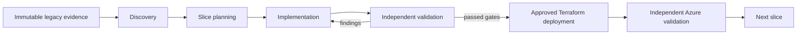

# Lab 0: Orientation and prerequisites

**Outcome:** Understand the repository, prepare the required tools, and verify a safe
starting state without beginning modernization.

Labs 1-5 examine customization primitives, Labs 6-8 establish lifecycle and quality
gates, and Lab 9 begins implementation. This lab verifies the starting conditions; it
does not create modernization evidence or target code.

## What this repository teaches

This repository is a lab for evidence-first modernization of COBOL and related z/OS
artifacts into React, Azure SQL Database, and either Java/Spring Boot or .NET/ASP.NET
Core. It does not translate files one by one. The process is:



You learn that process while deconstructing the GitHub Copilot primitives that control
it. The Modernization Orchestrator is intentionally saved for the final lab.

## Documentation map

Read these documents in order:

1. The repository [README](../../README.md) explains the purpose, lifecycle, evidence
   standard, example applications, and security rules.
2. [HOW-TO-MODERNIZE](../../HOW-TO-MODERNIZE.md) is the concise operating guide for
   the completed customization system.
3. The [modernization workspace contract](../../modernization/README.md) defines where
   generated evidence, decisions, plans, and validation results belong.
4. The [lab index](../README.md) defines the learning path and completion standard.

Return to the focused lab instructions rather than using the operating guide as a
shortcut. The purpose is to understand why each primitive exists before orchestration.

## Repository map

| Path | Purpose | May learners or agents modify it? |
|---|---|---|
| `.github/copilot-instructions.md` | Always-on evidence, lifecycle, architecture, and security policy | Only when intentionally changing repository policy |
| `.github/instructions/` | Rules loaded for matching legacy, evidence, frontend, backend, database, local SQL, or E2E paths | Only when intentionally changing path policy |
| `.github/skills/` | Reusable specialist procedures with references and scripts | Yes, as a customization exercise |
| `.github/agents/` | Stage ownership, tools, boundaries, and handoffs | Yes, as a customization exercise |
| `.github/hooks/` | Deterministic tool-use enforcement | Only with regression tests |
| `.github/scripts/` | Lifecycle transition validation and tests | Only with regression tests |
| `.github/templates/modernization/` | Canonical lifecycle and artifact indexes | Edit templates, not approved generated evidence |
| `legacy-source/` | Immutable COBOL and mainframe forensic evidence | **Never** |
| `modernization/` | Generated analysis, plans, decisions, traceability, and validation evidence | Yes, through the owning lifecycle stage |
| `target/` | Generated React, selected Java or .NET backend, Azure SQL code, tests, and runbooks | Created and modified during approved implementation |
| `labs/` | The curriculum you are following | Only when maintaining the lab itself |

## Legacy application map

The extraction contains three examples under `legacy-source/DEV1/`:

| Application | Domain represented by the available evidence | Used in labs |
|---|---|---|
| `SURVDEMO` | Survivor inquiry, entitlement validation, and monthly benefit processing | Common application for Labs 1-16 |
| `BANKDEMO` | Account inquiry, transaction validation/posting, and daily processing | Capstone option |
| `TRSYDEMO` | Payment extraction and bank reconciliation | Capstone option |

Application subdirectories represent mainframe artifact types rather than target
layers. Depending on the application, they include:

- `COBOL/` programs and business behavior;
- `COPY/` shared record layouts and communication areas;
- `BMS/` CICS screen maps;
- `CSD/` CICS resource and transaction definitions;
- `DDL/` Db2 schemas;
- `JCL/` batch job control;
- `PROC/` reusable JCL procedures;
- `CNTL/` utility and sort control statements;
- `SCHED/` scheduler dependencies and timing relationships.

No single directory is the whole application. Discovery must connect online, batch,
data, interface, and operational evidence.

## GitHub Copilot prerequisites

Confirm that your VS Code and GitHub Copilot environment supports:

- workspace repository and path-specific instructions;
- workspace skills and their bundled resources;
- custom agents and agent handoffs;
- workspace tool use and pre-tool-use hooks.

Sign in with an account entitled to use GitHub Copilot. Open the repository root as the
VS Code workspace so `.github/` customizations are discoverable.

## Tool prerequisites

Labs 1-8 require:

- Git and a real Git worktree;
- Python 3;
- a shell capable of running the supplied Python checks.

Labs 9-14 additionally require the versions approved during planning for:

- Node.js and the selected package manager;
- either an LTS JDK and Java build wrapper, or a .NET LTS SDK pinned by `global.json`;
- Docker Desktop when using the local SQL Server inner loop;
- an approved Azure SQL environment for Azure compatibility or readiness claims.

Labs 15-16 additionally require Terraform, Azure CLI, an approved disposable sandbox
subscription and region, Microsoft Entra access for the learner, and ownership of the
required DNS and network decisions. These labs use local Terraform state and do not
require a pipeline or Azure Developer CLI (`azd`).

### Enterprise deployment toolchain

The deployment labs use a bounded single-user sandbox profile:

| Responsibility | Lab tool or mechanism |
|---|---|
| Define and provision Azure resources | Terraform CLI with the pinned AzureRM provider |
| Store sandbox state | Local Terraform state in the learner's protected, source-ignored workspace |
| Authenticate the operator | Interactive Microsoft Entra sign-in through Azure CLI; no stored client secret |
| Run plan and apply | Terraform CLI on the learner's workstation against the named sandbox subscription |
| Authorize changes | Learner review bound to the saved-plan digest and sandbox environment; the agent cannot approve |
| Verify Azure state | Terraform outputs and state metadata plus approved Azure APIs, portal, CLI, or monitoring queries |

Azure CLI supplies the interactive Entra session and targeted queries. Terraform remains
the provisioning engine. `azd` is not a prerequisite, fallback, or hidden wrapper
around the lab workflow.

This local-state profile is only for one learner in a disposable, nonproduction
subscription. It has no remote locking, shared recovery, or pipeline audit trail. Never
commit, upload, or share state or saved-plan files. A shared or persistent environment
must move to protected remote state and workload identity federation before use.

Real z/OS extraction and characterization require separate approved, least-privilege
access. The supplied extraction supports local discovery exercises but does not prove
live-system outcomes.

## Readiness checks

Run these non-destructive checks from the repository root:

```powershell
git rev-parse --show-toplevel
python --version
python -B .github/hooks/test_protect_legacy_source.py -v
python -B .github/scripts/test_validate_lifecycle.py -v
```

Record the exact versions and results. The expected baseline is:

- `git rev-parse` prints this repository's root and exits with code 0;
- `python --version` reports Python 3 and exits with code 0;
- the hook regression suite reports 7 passing tests;
- the lifecycle regression suite reports 16 passing tests.

If the test count changes in a later repository revision, use a zero exit code and no
failed tests as the authority; update this lab when intentionally adding or removing
test cases. Stop on any failure rather than treating the remaining checks as proof of
readiness.

Before Lab 9, run the checks for the platform approved in Lab 7:

```powershell
node --version
docker version
java -version    # java-spring only
dotnet --info    # dotnet-aspnet-core only
```

Run only the selected backend check. Docker is required when the approved local SQL
gate uses the repository's containerized SQL Server profile; it is not needed for Labs
0-8.

Before Lab 15, verify the provisioning tool directly:

```powershell
terraform version
az version
az login
az account show
```

The generated target README supplies the approved wrapper and package-manager commands.
Do not install or select both backend toolchains merely to complete one slice.

If Git does not identify this directory as a worktree, obtain or initialize the lab as
a versioned repository before lifecycle work. Source and target revisions are required
handoff identities, not optional labels.

## Safe starting state

Before a fresh run:

- `legacy-source/` contains the supplied immutable evidence;
- `modernization/` contains only its contract README;
- `target/` may not exist until the approved implementation lab;
- no credentials, production records, tokens, or unmasked protected data are present.

Do not delete a previous run casually. Preserve its modernization and target artifacts
as a branch, tag, commit, or separate lab copy before starting over.

## Verify

You are ready for Lab 1 when you can answer:

1. Which directory is immutable, and what enforces that rule?
2. Where do recovered evidence, approved plans, target code, and validation results go?
3. Which tools are needed now, and which can wait until implementation?
4. Why must the workspace be versioned before lifecycle handoffs?
5. Which application is shared by Labs 1-16?

**Exit criterion:** The readiness checks pass, the repository map is understood, and no
modernization or target artifact has been generated.

Continue to [Lab 1](../01-context-and-boundary/README.md).