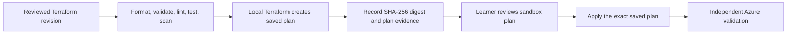

# Lab 15: Sandbox Azure architecture and local plan

**Modernization outcome:** A reviewable, revision-bound Terraform plan for a disposable
single-user Azure sandbox
**Copilot primitive:** Dedicated deployment agent, deployment skill, and infrastructure
path instructions

## Prerequisites

- Lab 14 produced a passed validation report for the exact target revision.
- `validate_lifecycle.py --transition to-deployment-plan` passes.
- The Azure, Terraform, local-state, private-network, DNS, identity, and approval
   prerequisites from Lab 0 are available; otherwise record the lab blocked.

## Learn

Deployment is its own lifecycle stage. The Azure Deployment Agent combines a scoped
role with a reusable procedure; path instructions constrain every generated Terraform
file. Deterministic lifecycle validation prevents an agent from deploying an
unvalidated target or approving its own plan.

The lab default is an HTTPS WAF edge with private application origins and private
connectivity to Azure Container Registry, Key Vault, and Azure SQL. Runtime access uses
managed identities and Microsoft Entra tokens. CI/CD uses workload identity federation,
not stored credentials. An approved ADR may substitute equivalent controls.

## Sandbox deployment model

Terraform CLI is the provisioning interface. One learner uses a protected local
workspace, local Terraform state, and an interactive Microsoft Entra identity to plan
and apply against a named disposable sandbox subscription. This profile removes the
pipeline prerequisite; it is not suitable for shared or persistent environments.



Do not use `azd` for initialization, packaging, provisioning, deployment, or
environment management. Azure CLI provides interactive authentication and targeted
verification, but it does not replace Terraform as the provisioning record.

Local state can contain sensitive values and has no remote locking or recovery. Before
planning, confirm `.terraform/`, `*.tfstate*`, and `*.tfplan` are ignored, the workspace
is not synchronized or shared, and the active Azure tenant and subscription are the
approved sandbox. Losing the state can orphan resources.

Establish and verify the interactive identity before running Terraform:

```powershell
az login --tenant <tenant-id>
az account set --subscription <subscription-id>
az account show --query "{user:user.name, tenant:tenantId, subscription:id, name:name}" --output table
$env:ARM_SUBSCRIPTION_ID = az account show --query id --output tsv
```

The identity must have only the approved sandbox roles. Do not create a client secret,
export an access token, or use Azure CLI to provision resources around Terraform.

## Exercise

1. Inspect the Azure Deployment Agent, `deploy-enterprise-azure-slice` skill, Azure
   infrastructure instructions, and deployment artifact templates.
2. Confirm independent validation passed for the exact target revision and run the
   lifecycle validator with `--transition to-deployment-plan`.
3. Record the environment, subscription, region, data classification, network CIDRs,
   DNS owners, ingress/egress, recovery objectives, identity owners, policies, logging,
   retention, budget, operator identity, and local-state profile in an ADR. Do not
   invent them.
4. Invoke **Prepare an Azure deployment plan**. Confirm it retrieves current Azure and
   Terraform guidance and identifies the approved sandbox subscription and operator.
5. Review generated Terraform under
   `<activeSlice.targetRoot>/infrastructure/`. Require local-state isolation, pinned
   constraints, WAF ingress, denied public origins, private endpoints and DNS, managed
   identities, Entra authentication, least-privilege RBAC, diagnostics, policy checks,
   backup, and rollback.
6. Run format, validate, lint, tests, security/policy scans, cost estimation, and a
   speculative plan locally using the learner's interactive Entra identity. Confirm
   the tenant, subscription, and signed-in account before creating the saved plan.
7. Inspect replacements, deletes, grants, exposure, exceptions, cost, and sensitive
   outputs. Keep the saved plan only in the protected, source-ignored local workspace
   and record its SHA-256 digest in `deployment-plan.json`; do not record its contents.
8. Bind the exact migration revision, protected source snapshot and pre-migration
   backup references, successful restore rehearsal, reconciliation plan, recovery
   runbook, retention, and database lifecycle protections into the deployment plan.
9. Confirm the agent updated lifecycle to deployment/`planned`, referenced the canonical
   deployment plan, reset approval to pending, and stopped. The validator checks state;
   it does not perform this mutation.

If no approved sandbox is available, complete the local and static checks, inspect an
instructor-provided redacted plan summary if available, and record the saved plan,
cost, policy, and connectivity checks as blocked. Do not distribute a saved plan file
or weaken networking or identity controls to make the lab executable.

## Gate

The plan must bind application, source, slice, target, Terraform, environment, and
saved-plan identities. Any public data-plane access, stored credential, broad role,
unowned DNS or operator identity, tracked state/plan file, failed scan, destructive
unprotected change, or shared use of local state blocks approval. So does a missing
restore rehearsal, mutable source snapshot, unresolved mapping, unowned reject, or
unapproved reconciliation tolerance.

**Exit criterion:** An accountable reviewer can approve or reject one immutable plan
without reading conversational history, and no Azure resources have been changed.

Continue to [Lab 16](../16-azure-deployment-validation/README.md).