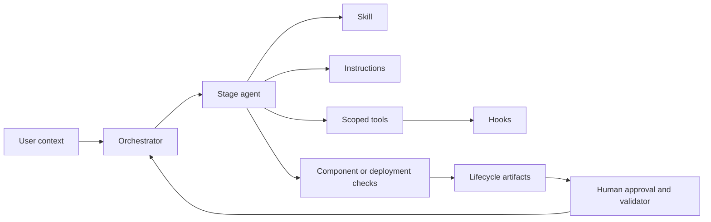

# Lab 17: Orchestrator capstone

**Modernization outcome:** Correctly route a second application to one lifecycle stage  
**Copilot primitive:** Orchestrator agent and delegated specialist contexts

## Learn

The orchestrator is introduced last because it coordinates primitives and quality gates
the learner now understands. It reads lifecycle state, selects one specialist, passes
explicit identity, and reports the next gate. It does not perform specialist work or
silently advance.

For this capstone, [the orchestrator agent](../../.github/agents/modernization-orchestrator.agent.md)
is the routing artifact. `APP-BANKDEMO` and `APP-TRSYDEMO` have immutable evidence but
no lifecycle manifest, so either choice must route to the Legacy Analyst for discovery.
The discovery skill and legacy-source instructions govern that delegated stage; the
next gate is a reviewable discovery package with human approval still pending.

## Exercise

1. Choose `APP-BANKDEMO` or `APP-TRSYDEMO`.
2. Confirm that `modernization/<application-id>/lifecycle.json` does not exist, then
   use the routing statement above to identify the current stage, owning specialist,
   skill/instructions, and next gate.
3. Inspect the Modernization Orchestrator agent and locate the missing-manifest route.
4. Select it and submit:

   ```text
   Start or continue modernization for APP-BANKDEMO using only repository
   lifecycle state and immutable evidence. Delegate exactly one valid stage,
   report its gate status and explicit handoff identities, and do not silently
   advance to the next stage.
   ```

5. Inspect the delegated specialist and ask the orchestrator to explain which lifecycle
   state, artifacts, agent, skill, instructions, tools, hook, and gate controlled it.
6. Compare the explanation with the explicit routing statement and routing table.

## Verify

- The selected second application has no manifest and routes to discovery.
- Exactly one specialist stage is delegated in this exercise.
- The orchestrator does not edit, execute commands, approve work, or perform the
  specialist procedure itself.
- The result names unresolved decisions, evidence level, and next valid handoff.

Then inspect the orchestrator routing table and explain, without fabricating or editing
lifecycle state, why deployment/`planned` routes to the Azure Deployment Agent and
deployment/`deployed` routes to the Validation Critic. Those routes were exercised in
Labs 15-16 for `APP-SURVDEMO`; they are not observable from a missing second-application
manifest in this single-stage capstone run.

## Explain



**Exit criterion:** You can explain every arrow and distinguish component evidence,
integrated evidence, parity, Terraform convergence, Azure validation, production
readiness, and cutover authority.

Return to the [lab index](../README.md) and review the completion standard.