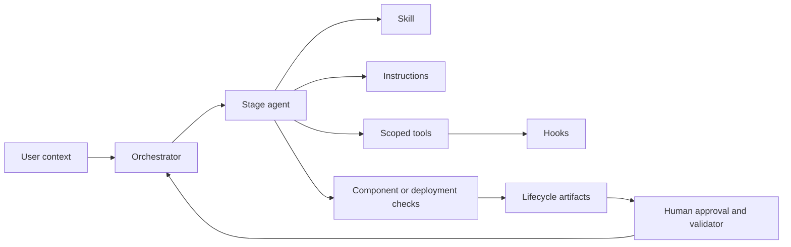

# Lab 17: Orchestrator capstone

**Modernization outcome:** Correctly route a second application to one lifecycle stage  
**Copilot primitive:** Orchestrator agent and delegated specialist contexts

## Learn

The orchestrator is introduced last because it coordinates primitives and quality gates
the learner now understands. It reads lifecycle state, selects one specialist, passes
explicit identity, and reports the next gate. It does not perform specialist work or
silently advance.

## Exercise

1. Choose `APP-BANKDEMO` or `APP-TRSYDEMO`.
2. Predict whether a lifecycle manifest exists, the current stage, the owning
   specialist, its skill/instructions, and the next applicable quality gate.
3. Inspect the Modernization Orchestrator agent.
4. Select it and submit:

   ```text
   Start or continue modernization for APP-BANKDEMO using only repository
   lifecycle state and immutable evidence. Delegate exactly one valid stage,
   report its gate status and explicit handoff identities, and do not silently
   advance to the next stage.
   ```

5. Observe the delegated specialist and ask the orchestrator to explain which manifest
   fields, artifacts, agent, skill, instructions, tools, hook, and gate controlled it.
6. Compare the explanation with your prediction.

## Verify

- Observe that the selected second application has no manifest and routes to discovery.
- Observe that exactly one specialist stage is delegated in this exercise.
- The orchestrator does not edit, execute commands, approve work, or perform the
  specialist procedure itself.
- The result names unresolved decisions, evidence level, and next valid handoff.

Then inspect the orchestrator routing table and explain, without fabricating or editing
lifecycle state, why deployment/`planned` routes to the Azure Deployment Agent and
deployment/`deployed` routes to the Validation Critic. Those routes were exercised in
Labs 15-16 for `APP-SURVDEMO`; they are not observable from a missing second-application
manifest in this single-stage capstone run.

## Explain



**Exit criterion:** You can explain every arrow and distinguish component evidence,
integrated evidence, parity, Terraform convergence, Azure validation, production
readiness, and cutover authority.

Return to the [lab index](../README.md) and review the completion standard.